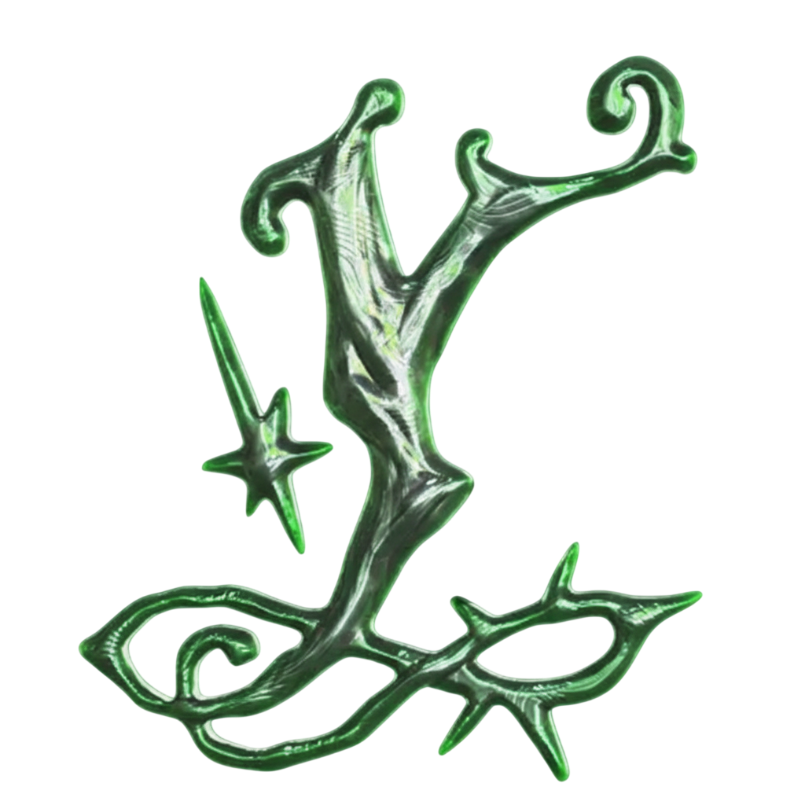

<div align="center">
  <h1>YapYap Project Patcher</h1>



  <p>
    A game wrapper that generates a Unity project from YapYap's build that can be playable in-editor
  </p>
</div>

<div align="center">

<span></span>
<a href="https://github.com/nomnomab/unity-project-patcher">Unity Project Patcher</a>
<span> · </span>
<a href="https://github.com/nomnomab/unity-project-patcher/issues/">Report Bug</a>
<span> · </span>
<a href="https://github.com/nomnomab/unity-project-patcher/issues/">Request Feature</a>

</h4>

</div>

<br />

# Table of Contents

- [About the Project](#about-the-project)
- [Getting Started](#getting-started)
- [Installation](#installation)
- [Usage](#usage)
- [FAQ](#faq)

## About the Project

This tool is a game wrapper on top of the [Unity Project Patcher](https://github.com/nomnomab/unity-project-patcher).

This takes a build of YapYap, extracts its assets/scripts/etc, and then generates a project for usage in the Unity editor.

> [!IMPORTANT]  
> This tool does not distribute game files. It simply works off of your copy of the game!
>
> Also, this tool is for **personal** use only. Do not re-distrubute game files to others.

## Getting Started

Make sure you have the following before using the tool in any way:

- [Git](https://git-scm.com/download/win)
- [.NET 9.0](https://dotnet.microsoft.com/en-us/download/dotnet/9.0)
  - For the Patcher to run Asset Ripper

## Installation

### Unity Project

- Requires [Unity 6000.0.67f1](https://unity.com/releases/editor/whats-new/6000.0.67f1)
- Universal Render Pipeline (URP/SRP 3D)

Create a new Unity project with the above requirements before getting started.

You will need to install three packages in sequence here:

- Unity Project Patcher: `https://github.com/nomnomab/unity-project-patcher.git`
- Unity Project Patcher BepInEx: `https://github.com/Kesomannen/unity-project-patcher-bepinex.git`
  - [Can be disabled](#disabling-bepinex-usage)
- This project

### Installing the Unity Project Patcher core

1. Open the Package Manager from `Window > Package Manager`
2. Click the '+' button in the top-left of the window
3. Click 'Add package from git URL'
4. Provide the URL of the this git repository: `https://github.com/nomnomab/unity-project-patcher.git`
   - If you are using a specific version, you can append it to the end of the git URL, such as `#v1.2.3`
5. Click the 'add' button

```json
"com.nomnom.unity-project-patcher": "https://github.com/nomnomab/unity-project-patcher.git"
```

- If you are using a specific version, you can append it to the end of the git URL, such as `#v1.2.3`

### Installing this Game Wrapper

The same steps as previously, just with `https://github.com/Jettcodey/unity-yapyap-project-patcher.git`

### Installing the BepInEx Wrapper

Open the tool window `Tools > Unity Project Patcher > Open Window` and press the `Install BepInEx` button.

Otherwise, follow the steps at https://github.com/nomnomab/unity-project-patcher-bepinex

#### Disabling BepInEx Usage

If you don't want to use plugins, then follow the steps at https://github.com/nomnomab/unity-project-patcher-bepinex#disabling-this-package

## Usage

The tool window can be opened via `Tools > Unity Project Patcher > Open Window`

> [!IMPORTANT]  
> This tool mostly supports patching an already patched project, although this can lead to broken assets.
> So make sure you back up your project beforehand.

Estimated patch durations:

- Fresh patch: ~10 min
- Already patched: TBD

These can vary wildly depending on system speed and project size.

## Credits
Unity YapYap Project Patcher developed by:

- [ThatDRW](https://github.com/ThatDRW/)
- [Darmuh](https://github.com/darmuh)
- [Jettcodey](https://github.com/Jettcodey)

## FAQ

**Q: How do I get rid of the "No cameras rendering" warning?**

Right click the `Game` window and uncheck the checkbox labeled "Warn if no cameras rendering";

---

For more questions, see core project's FAQ: https://github.com/nomnomab/unity-project-patcher#faq
